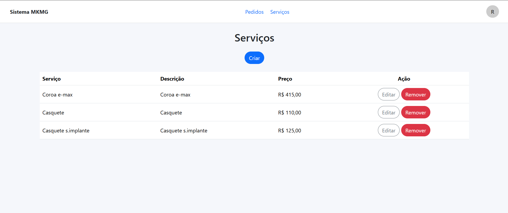
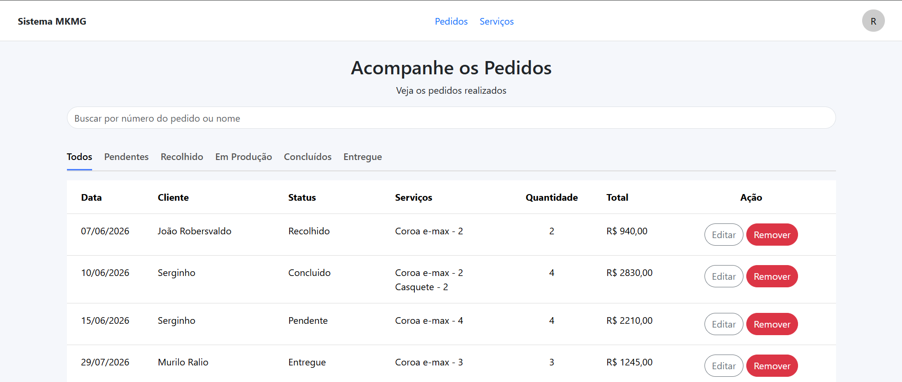

# 🦷 Laboratório de Prótese

Sistema web de gestão para laboratórios de prótese dentária, desenvolvido como Projeto Interdisciplinar da FATEC Rio Preto (4º semestre). A aplicação permite o controle de usuários, dentistas, protéticos, serviços e pedidos em um único fluxo, com cálculo automático de valores e acompanhamento de status.

| Login | Cadastro |
|:---:|:---:|
|  |  |

| Serviços | Pedidos |
|:---:|:---:|
|  |  |

---

## Tecnologias utilizadas

- C# / .NET 10
- ASP.NET Core MVC
- Entity Framework Core
- SQL Server
- HTML5, CSS3, Bootstrap
- Git e GitHub

---

## Funcionalidades

- Cadastro e autenticação de usuários
- Cadastro de dentistas e protéticos
- Cadastro e gerenciamento de serviços
- Criação e acompanhamento de pedidos (com carrinho)
- Controle de status dos pedidos
- Cálculo automático do valor total dos pedidos

---

## Estrutura do projeto

```
Controllers/
Data/
Enums/
Migrations/
Models/
ViewModels/
Views/
wwwroot/
```

---

## Como executar

### Pré-requisitos

- [.NET 10 SDK](https://dotnet.microsoft.com/download)
- SQL Server (LocalDB, Express ou completo)
- Visual Studio 2022+ (ou VS Code com extensão C#)

### Passo a passo

1. Clone o repositório

```bash
git clone https://github.com/Murilo004/Interdiciplinar-FATEC.git
```

2. Configure a connection string em `appsettings.json` (ou `appsettings.Development.json`) apontando para sua instância do SQL Server:

```json
"ConnectionStrings": {
  "DefaultConnection": "Server=SEU_SERVIDOR;Database=LabProtese;Trusted_Connection=True;TrustServerCertificate=True;"
}
```

3. Restaure as dependências

```bash
dotnet restore
```

4. Aplique as migrações para criar o banco de dados

```bash
dotnet ef database update
```

5. Execute a aplicação

```bash
dotnet run
```

---

## Aprendizados

Durante o desenvolvimento deste projeto foi possível aplicar na prática:

- Arquitetura MVC e Programação Orientada a Objetos
- Modelagem de entidades e relacionamento entre elas no EF Core (incluindo herança TPT)
- CRUD completo com regras de negócio (cálculo de pedidos, controle de status)
- Autenticação e controle de acesso por perfil de usuário
- Correção de vulnerabilidades de segurança (ex: IDOR) e validações de dados
- Versionamento colaborativo com Git e GitHub

---

## Desenvolvido por

- Murilo Sonsin Ralio — [Murilo Rálio](https://github.com/Murilo004)
- Gabriel Henrique Gonçalves Vicente — [Gabriel Vicente](https://github.com/gabrielvicente3425-droid)

Projeto desenvolvido para a disciplina de Projeto Interdisciplinar da FATEC.
